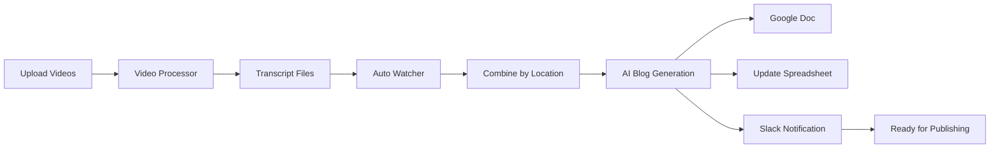

# 🤖 AI Content Pipeline

**Fully Automated Video-to-Blog Content Generation System**

Transform your video content into professional blog posts automatically using AI. This system monitors your video processor, combines transcripts by location, generates SEO-optimized blog posts with Claude AI, creates Google Docs, tracks everything in spreadsheets, and sends Slack notifications - all completely hands-free.

## ✨ Features

- 🎬 **Auto Video Processing** - Monitors video processor for new transcript files
- 🤖 **AI Blog Generation** - Creates professional blog posts using Claude AI
- 📄 **Google Docs Integration** - Automatically creates formatted blog documents
- 📊 **Smart Tracking** - Maintains master spreadsheet of all content
- 📱 **Slack Notifications** - Real-time alerts with direct links
- 🚫 **Duplicate Prevention** - Never processes the same content twice
- 🗂️ **Location Grouping** - Combines related videos by location/topic
- ⚡ **Real-time Monitoring** - Watches for new content 24/7

## 🎯 Workflow Overview



## 🚀 Quick Start

### Prerequisites

- Python 3.8+
- Google Cloud Project with Docs/Drive/Sheets API enabled
- Anthropic Claude API key
- Slack webhook (optional)
- Video processor that creates transcript JSON files

### Installation

1. **Clone the repository:**
   ```bash
   git clone https://github.com/kodowjam/ai-content-pipeline.git
   cd ai-content-pipeline
   ```

2. **Create virtual environment:**
   ```bash
   python3 -m venv content-env
   source content-env/bin/activate  # On Windows: content-env\Scripts\activate
   ```

3. **Install dependencies:**
   ```bash
   pip install anthropic google-auth google-auth-oauthlib google-auth-httplib2 google-api-python-client requests python-dotenv watchdog
   ```

4. **Set up environment variables:**
   ```bash
   # Create .env file
   cp .env.example .env
   ```
   
   Edit `.env` with your credentials:
   ```env
   ANTHROPIC_API_KEY=your_anthropic_api_key_here
   GOOGLE_OAUTH_CREDENTIALS_PATH=path/to/your/credentials.json
   SLACK_WEBHOOK_URL=https://hooks.slack.com/services/your/webhook/url
   ```

5. **Complete Google OAuth setup:**
   ```bash
   python3 smart_pipeline_runner.py --check-only
   ```
   Follow the browser authentication flow.

6. **Configure your Google Sheet ID (optional):**
   ```bash
   python3 -c "
   import json
   from datetime import datetime
   
   sheet_id = 'your_google_sheet_id_here'
   data = {
       'sheet_id': sheet_id,
       'created_at': datetime.now().isoformat()
   }
   
   with open('.shared_sheet_id.json', 'w') as f:
       json.dump(data, f, indent=2)
   
   print(f'✅ Configured Google Sheet: {sheet_id}')
   "
   ```

## 🎮 Usage

### One-Time Processing

Process existing transcript files:

```bash
# Check what would be processed
python3 smart_pipeline_runner.py --check-only

# Process new combined transcript files
python3 smart_pipeline_runner.py

# Create shortcut script
python3 smart_pipeline_runner.py --create-shortcut
./run_smart_pipeline.sh
```

### Automatic Monitoring

Start the auto-watcher for continuous monitoring:

```bash
# Scan and combine existing files once
python3 auto_transcript_watcher.py --video-processor-path /path/to/video-processor --scan-only

# Start continuous monitoring (recommended)
python3 auto_transcript_watcher.py --video-processor-path /path/to/video-processor --delay 120

# Run in background
nohup python3 auto_transcript_watcher.py --video-processor-path /path/to/video-processor --delay 120 > watcher.log 2>&1 &
```

### Manual Transcript Combination

For specific transcript files:

```bash
# Combine Discovery Park transcripts
python3 simple_transcript_combiner.py --video-processor-path /path/to/video-processor --check-only
python3 simple_transcript_combiner.py --video-processor-path /path/to/video-processor
```

## 📁 Project Structure

```
ai-content-pipeline/
├── src/                                    # Core pipeline modules
│   ├── blog_generator.py                   # AI blog post generation
│   ├── google_oauth_integration.py         # Google services integration
│   └── complete_oauth_pipeline.py          # Main pipeline orchestrator
├── Input/transcripts/                      # Combined transcript files
├── config/                                 # Configuration and credentials
│   └── token.pickle                        # Google OAuth token
├── auto_transcript_watcher.py              # Automatic file monitoring
├── smart_pipeline_runner.py               # Smart processing (no duplicates)
├── simple_transcript_combiner.py          # Manual transcript combination
├── .env                                    # Environment variables
├── .shared_sheet_id.json                  # Shared Google Sheet configuration
├── .pipeline_processed.json               # Processing history
├── .location_states.json                  # Location combination states
└── requirements.txt                        # Python dependencies
```

## ⚙️ Configuration

### Video Processor Integration

The system expects transcript files in this structure:

```
video-processor/
└── analysis/
    ├── Discovery Park July 9/
    │   ├── Discovery Park July 9_1/
    │   │   └── Discovery_Park_July_9_1_transcription.json
    │   ├── Discovery Park July 9_2/
    │   │   └── Discovery_Park_July_9_2_transcription.json
    │   └── ...
    └── Mt Washington/
        ├── mt washington 2/
        │   └── mt_washington_2_transcription.json
        └── ...
```

### Transcript File Format

Transcript JSON files should contain:

```json
[
  {
    "start": 0.0,
    "end": 5.2,
    "text": "Today I'm hiking up Mount Washington..."
  },
  {
    "start": 5.2,
    "end": 10.1,
    "text": "The weather is perfect for this adventure."
  }
]
```

Or with filtered transcription:

```json
{
  "filtered_transcription": [
    {
      "start": 0.0,
      "end": 5.2,
      "text": "Today I'm hiking up Mount Washington..."
    }
  ]
}
```

### Environment Variables

| Variable | Description | Required |
|----------|-------------|----------|
| `ANTHROPIC_API_KEY` | Claude AI API key | Yes |
| `GOOGLE_OAUTH_CREDENTIALS_PATH` | Path to Google OAuth credentials JSON | Yes |
| `SLACK_WEBHOOK_URL` | Slack webhook for notifications | Optional |

## 🤖 AI Blog Generation

The system generates comprehensive blog posts with:

- **SEO-optimized titles** with location keywords
- **Meta descriptions** under 150 characters
- **Personal journal-style content** (first-person narrative)
- **Subheadings** for readability
- **Image placeholders** with descriptions
- **Relevant tags** for categorization
- **Inspiring environmental quotes**
- **Word count optimization** (typically 400-500 words)

### Example Generated Blog Post

```markdown
# Discovery Park Seattle: A Hidden Gem for Hiking and Dog Adventures – July Trail Report

**Meta Description:** Explore Discovery Park Seattle's diverse trails, wildflowers, and dog-friendly paths in this detailed July hiking report.

Today I embarked on one of the most rewarding urban hiking experiences...

[IMAGE: Discovery Park trailhead with morning light]

## The Early Start
Setting out before dawn, I knew this adventure would be special...

## Summit Victory
Reaching the highest point was pure euphoria...

As John Muir wisely said, "The mountains are calling and I must go."

**Tags:** discovery-park, seattle-hiking, dog-friendly-trails, outdoor-adventure, trail-report
```

## 📊 Google Sheets Integration

The system maintains a comprehensive tracking spreadsheet with:

- **Date Created** - When the blog was generated
- **Title** - Full blog post title
- **Google Doc URL** - Direct link to the document
- **Status** - DRAFT, PUBLISHED, etc.
- **Primary Keyword** - Main SEO target
- **Tags** - All content tags
- **Word Count** - Article length
- **Meta Description** - SEO description
- **Quote Author** - Featured environmentalist quote

## 📱 Slack Integration

Automated notifications include:

- **Blog post title and summary**
- **Word count and keyword info**
- **Direct links to Google Doc and tracking sheet**
- **Rich formatting with action buttons**

Example notification:
```
🎉 New Blog Post Created!

📝 Discovery Park Seattle: A Hidden Gem for Hiking and Dog Adventures
📊 Word Count: 447 | Keyword: Discovery Park hiking
🎯 Quote by: John Muir

[View Google Doc] [View Tracking Sheet]
```

## 🔧 Advanced Features

### Intelligent Duplicate Prevention

- **File hashing** to detect content changes
- **Processing history** tracking
- **Smart state management** between restarts
- **Cross-component synchronization**

### Batch Processing with Delays

- **Configurable delays** (default: 2 minutes)
- **Timer reset** on new file detection
- **Batch combination** when processing multiple videos
- **Prevents partial processing**

### Location-Based Organization

- **Automatic grouping** by location/topic
- **Consistent naming** across components
- **Hierarchical file organization**
- **Smart path detection**

## 🛠 Troubleshooting

### Common Issues

**Google OAuth Errors:**
```bash
# Re-authenticate
rm config/token.pickle
python3 smart_pipeline_runner.py --check-only
```

**Missing Transcript Files:**
```bash
# Check file paths
python3 auto_transcript_watcher.py --video-processor-path /correct/path --scan-only
```

**Duplicate Processing:**
```bash
# Reset processing history (use carefully)
rm .pipeline_processed.json .location_states.json
```

**Environment Variables:**
```bash
# Test environment setup
python3 -c "
from dotenv import load_dotenv
import os
load_dotenv()
print('Anthropic API:', 'Found' if os.environ.get('ANTHROPIC_API_KEY') else 'Missing')
print('Google Creds:', os.environ.get('GOOGLE_OAUTH_CREDENTIALS_PATH', 'Missing'))
print('Slack Webhook:', 'Found' if os.environ.get('SLACK_WEBHOOK_URL') else 'Missing')
"
```

### Debug Commands

```bash
# Check processing history
python3 smart_pipeline_runner.py --show-history

# View location states
cat .location_states.json

# Test individual components
python3 -c "from src.blog_generator import BlogGenerator; print('Blog generator OK')"
python3 -c "from src.google_oauth_integration import GoogleOAuthIntegration; print('Google integration OK')"
```

## 🚀 Performance Tips

- **Use SSD storage** for faster file operations
- **Run watcher on dedicated server** for 24/7 monitoring
- **Adjust delay settings** based on video processing time
- **Monitor system resources** during batch processing
- **Use background processing** for production environments

## 🤝 Contributing

1. Fork the repository
2. Create a feature branch (`git checkout -b feature/amazing-feature`)
3. Commit your changes (`git commit -m 'Add amazing feature'`)
4. Push to the branch (`git push origin feature/amazing-feature`)
5. Open a Pull Request

## 📝 License

This project is licensed under the MIT License - see the [LICENSE](LICENSE) file for details.

## 🙏 Acknowledgments

- **Anthropic Claude** for AI blog generation
- **Google Workspace APIs** for document and spreadsheet integration
- **Slack API** for real-time notifications
- **Watchdog** for file system monitoring

## 📞 Support

For questions, issues, or feature requests:

1. **Check the troubleshooting section** above
2. **Open an issue** on GitHub
3. **Review existing discussions** for similar problems

---

**Built with ❤️ for automated content creation**

<<<<<<< HEAD
Transform your video content into professional blog posts with the power of AI automation.
=======
Transform your video content into professional blog posts with the power of AI automation.
>>>>>>> eea0972 (🔧 Fix Google OAuth token refresh issues and improve automation)
